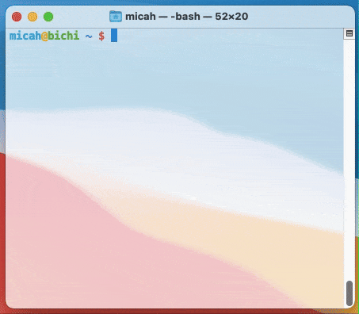

# Quick Terminal-bound To-Do List

A command-line to-do list manager for quick and easy task tracking directly within your terminal.



## Features

- **List Items**: Display all your to-do items with ease.
- **Add Items**: Quickly add new tasks to your list.
- **Remove Items**: Remove tasks that are no longer needed.
- **Mark Items as Done**: Check off completed tasks.
- **Delete List**: Clear your entire to-do list when needed.

## Usage

To get started, clone the repository and run the script:

```bash
git clone https://github.com/micahbecchio/Bash_List.git
cd your-repo-name
./main.sh
```

Available commands:

- `./main.sh list` - List all to-do items.
- `./main.sh add "Your task here"` - Add a new item.
- `./main.sh remove [item-number]` - Remove an item.
- `./main.sh done [item-number]` - Mark an item as done.
- `./main.sh clear` - Delete all items from the list.

## Dependencies

- Bash shell
- `sed` for inline editing of files
- `cat` for displaying file contents